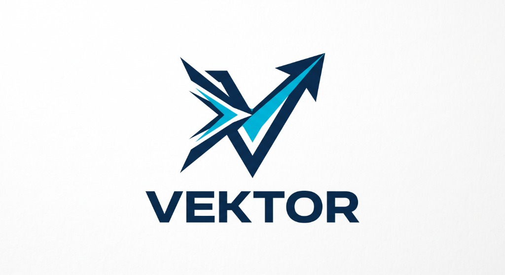

<p align="center">
  
</p>

# Vektor ⚡

> **Plataforma de Inteligência de Carreira com IA e Dados para Estudantes e Profissionais de Tecnologia**

[](https://vektor-career.vercel.app)
[](https://vektor-0nam.onrender.com)
[](https://fastapi.tiangolo.com/)
[](https://react.dev/)
[](https://python.org)
[](LICENSE)

O **Vektor** é uma aplicação Full Stack moderna que utiliza Inteligência Artificial generativa (Google Gemini Flash) e engenharia de dados para analisar currículos em PDF, comparar competências com vagas reais de estágio no mercado de tecnologia (via Jooble API) e gerar diagnósticos, reescrita de currículo otimizada para ATS e cartas de apresentação personalizadas.

---

## 🌐 Deploy em Produção

- 🖥️ **Aplicação Web (Frontend)**: [vektor-career.vercel.app](https://vektor-career.vercel.app)
- ⚙️ **API & Swagger Docs (Backend)**: [vektor-0nam.onrender.com/docs](https://vektor-0nam.onrender.com/docs)

---

## 🌟 Principais Funcionalidades

- 📄 **Leitura e Extração de PDF**: Processamento assíncrono e extração limpa de experiências, competências e objetivos.
- ⚡ **Batch Matching de Alta Performance**: Avaliação contextual em lote via Google Gemini, reduzindo o tempo de análise de 40 segundos para menos de 4 segundos.
- 💼 **Busca Integrada de Vagas Reais**: Conexão em tempo real com APIs de vagas brasileiras (Jooble & Adzuna).
- 🎯 **Score de Compatibilidade com Diagnóstico**: Classificação percentual de aderência candidato-vaga (0 a 100%) com explicação analítica de pontos fortes e lacunas técnicas.
- 📝 **Adaptador de Currículo para ATS**: Reescrita e adaptação de tópicos do currículo com as palavras-chave ideais para passar pelos filtros automáticos de triagem (ATS).
- ✉️ **Gerador de Cartas de Apresentação**: Criação instantânea de cartas de apresentação personalizadas para cada oportunidade.
- 💾 **Histórico Persistente (SQLite)**: Histórico completo de análises armazenado localmente para acompanhamento de evolução.
- 📊 **Dashboard & Tendências de Mercado**: Mineração de dados exibindo as tecnologias e habilidades mais demandadas no mercado de estágio.

---

## 🛠️ Stack Tecnológica

### Backend
- **Linguagem**: Python 3.11+
- **Framework Web**: FastAPI + Uvicorn (ASGI assíncrono)
- **Inteligência Artificial**: Google Gemini Flash API (`gemini-flash-latest` / `gemini-3.5-flash-lite`) com tolerância a falhas
- **Banco de Dados**: SQLite + SQLAlchemy ORM
- **Processamento de Dados**: Pydantic v2, PyPDF, Requests
- **Testes Automatizados**: Pytest, FastAPI TestClient

### Frontend
- **Biblioteca**: React 19 + Vite
- **Navegação & UI**: Design System Dark SaaS com Lucide Icons
- **Gerenciamento de Estado**: React Context API
- **Comunicação**: Axios com sanitização de endpoints e tratamento de erros

---

## 🗺️ Roadmap de Evolução

- [x] **v1.0**: Protótipo inicial com Ollama local e busca básica.
- [x] **v2.0 (Atual)**: Arquitetura em nuvem (Gemini Cloud), batch matching 10x mais rápido, reescrita ATS, nova UI SaaS e deploy completo em produção.
- [ ] **v2.1**: Integração com novos agregadores de vagas e filtros avançados por estado/remoto.
- [ ] **v3.0**: Módulo de métricas de evolução temporal do perfil profissional e exportação direta de currículos formatados em PDF.

---

## 🚀 Como Executar Localmente

### 1. Clonar o repositório
```bash
git clone https://github.com/ogarctorres/job-matcher-.git
cd job-matcher-
```

### 2. Backend
```bash
cd backend
python -m venv venv
# Windows:
.\venv\Scripts\activate
# Linux/Mac:
source venv/bin/activate

pip install -r requirements.txt
```

Crie o arquivo `.env` baseado no `.env.example`:
```env
GEMINI_API_KEY=sua_chave_gemini_aqui
IA_PROVIDER=gemini
JOOBLE_API_KEY=sua_chave_jooble_aqui
```

Inicie o servidor:
```bash
python -m uvicorn app.main:app --reload
```
Acesse a documentação interativa em: `http://127.0.0.1:8000/docs`

### 3. Frontend
Em outro terminal:
```bash
cd frontend
npm install
npm run dev
```
Acesse no navegador: `http://localhost:5173`

---

## 🧪 Testes Automatizados

Para rodar a suíte de testes unitários e de integração do backend:
```bash
cd backend
pytest
```

---

## 📄 Licença & Direitos Autorais
Código proprietário sob proteção de direitos autorais (All Rights Reserved). Disponibilizado publicamente exclusivamente para avaliação técnica e acadêmica. Veja [LICENSE](LICENSE) para detalhes dos termos de uso.

---

## 👤 Autor

**Vinicius Garcia Torres**
- Estudante de Ciência da Computação (2º Semestre)
- GitHub: [@ogarctorres](https://github.com/ogarctorres)
